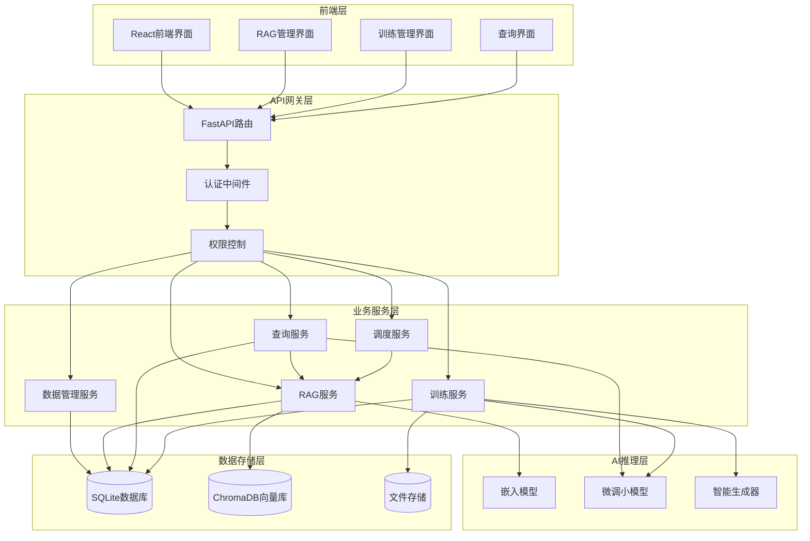
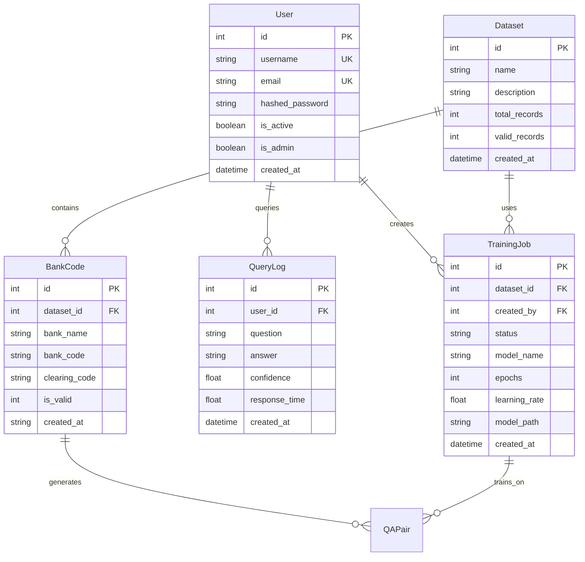

# 设计文档

## 概述

联行号智能检索系统是一个基于RAG（检索增强生成）技术的企业级AI平台，专门用于银行联行号的智能检索和查询。系统采用现代化的微服务架构，结合向量数据库、小模型微调和智能训练数据生成技术，为用户提供高精度、高性能的银行代码检索服务。

### 核心特性

- **RAG增强检索**: 基于ChromaDB向量数据库的语义检索，支持自然语言查询
- **小模型微调**: 使用LoRA技术微调Qwen2.5系列模型，专门优化银行代码检索任务
- **智能数据生成**: 自动生成多样化训练样本，提高模型泛化能力
- **实时推理服务**: 毫秒级响应的查询处理，支持批量查询和缓存优化
- **企业级管理**: 完整的用户认证、权限管理、任务调度和监控系统

### 技术栈

- **后端**: FastAPI + SQLAlchemy + SQLite
- **前端**: React + TypeScript + Ant Design
- **AI框架**: HuggingFace Transformers + PEFT (LoRA)
- **向量数据库**: ChromaDB + sentence-transformers
- **部署**: Docker + Docker Compose
- **任务调度**: APScheduler

## 架构

### 系统架构图



### 分层架构

#### 1. 前端展示层
- **React应用**: 基于TypeScript的现代化Web界面
- **组件化设计**: 可复用的UI组件库
- **响应式布局**: 支持多种屏幕尺寸
- **实时更新**: WebSocket连接实现实时状态更新

#### 2. API服务层
- **RESTful API**: 标准化的HTTP接口
- **认证授权**: JWT令牌认证 + RBAC权限控制
- **请求验证**: Pydantic模型验证输入数据
- **错误处理**: 统一的异常处理和错误响应

#### 3. 业务逻辑层
- **服务分离**: 按功能模块划分独立服务
- **依赖注入**: 松耦合的服务依赖管理
- **事务管理**: 数据一致性保证
- **缓存策略**: 多层缓存提升性能

#### 4. 数据访问层
- **ORM映射**: SQLAlchemy对象关系映射
- **连接池**: 数据库连接复用
- **索引优化**: 查询性能优化
- **数据迁移**: 版本化的数据库结构管理

## 组件和接口

### 核心组件

#### 1. RAG服务 (RAGService)

**职责**: 基于向量数据库的检索增强生成服务

**核心功能**:
- 向量化银行数据并存储到ChromaDB
- 基于语义相似度检索相关银行信息
- 支持混合检索（向量检索 + 关键词检索）
- 自动管理向量数据库的创建和更新

**技术实现**:
```python
class RAGService:
    def __init__(self, db: Session, vector_db_path: str, embedding_model_name: str)
    async def initialize_vector_db(self, force_rebuild: bool) -> bool
    async def retrieve_relevant_banks(self, question: str, top_k: int, similarity_threshold: float) -> List[Dict]
    async def load_from_file(self, file_path: str, force_rebuild: bool) -> bool
    async def update_vector_db(self) -> bool
    async def hybrid_retrieve(self, question: str, top_k: int, vector_weight: float, keyword_weight: float) -> List[Dict]
```

**关键特性**:
- **嵌入模型**: sentence-transformers/paraphrase-multilingual-MiniLM-L12-v2
- **向量维度**: 384维向量表示
- **批量处理**: 支持100条记录批量向量化
- **相似度阈值**: 可配置的检索精度控制
- **关键词提取**: 智能银行名称关键词映射

#### 2. 查询服务 (QueryService)

**职责**: 使用训练好的模型进行实时推理和查询处理

**核心功能**:
- 加载和管理微调后的小模型
- 处理用户自然语言查询
- 结合RAG检索结果生成准确答案
- 查询缓存和性能优化

**技术实现**:
```python
class QueryService:
    def __init__(self, db: Session, model_path: str, base_model_name: str)
    def load_model(self, model_path: str) -> None
    def query(self, question: str, user_id: int, log_query: bool, use_rag: bool) -> Dict[str, Any]
    def batch_query(self, questions: List[str], user_id: int, log_queries: bool) -> List[Dict[str, Any]]
    def generate_answer_with_small_model(self, question: str, rag_results: List[Dict]) -> str
    def extract_bank_entities_with_small_model(self, question: str) -> Dict[str, str]
```

**关键特性**:
- **模型支持**: Qwen2.5-0.5B/1.5B/3B系列
- **LoRA微调**: 高效的参数微调技术
- **设备适配**: 支持CUDA/MPS/CPU推理
- **智能匹配**: 基于相似度的最佳结果选择
- **查询缓存**: 1小时TTL的结果缓存

#### 3. 训练引擎 (TrainingEngine)

**职责**: 模型训练和微调管理

**核心功能**:
- 基于LoRA技术的模型微调
- 训练进度监控和日志记录
- 支持多种基础模型
- 训练任务队列管理

**技术实现**:
```python
class TrainingEngine:
    def __init__(self, db: Session)
    def start_training(self, job_id: int) -> bool
    def stop_training(self, job_id: int) -> bool
    def get_training_progress(self, job_id: int) -> Dict
    def load_training_data(self, dataset_id: int) -> List[Dict]
    def setup_lora_model(self, base_model_name: str, lora_config: Dict) -> PeftModel
```

**关键特性**:
- **LoRA配置**: r=16, alpha=32, dropout=0.05
- **训练参数**: 可配置的学习率、批次大小、训练轮数
- **进度跟踪**: 实时的训练进度和损失监控
- **错误恢复**: 训练失败自动重试机制

#### 4. 智能数据生成器 (SmartGenerator)

**职责**: 从标准银行数据生成多样化训练样本

**核心功能**:
- 基于规则的问题模板生成
- 大模型增强的自然语言生成
- 多样化查询模式覆盖
- 质量控制和去重

**技术实现**:
```python
class SmartGenerator:
    def __init__(self, db: Session, llm_config: Dict)
    def generate_qa_pairs(self, bank_records: List[BankCode], samples_per_bank: int) -> List[QAPair]
    def generate_rule_based_questions(self, bank_record: BankCode) -> List[str]
    def enhance_with_llm(self, questions: List[str], bank_record: BankCode) -> List[str]
    def validate_and_filter(self, qa_pairs: List[QAPair]) -> List[QAPair]
```

**关键特性**:
- **模板多样性**: 10+种问题模板
- **LLM增强**: 通义千问API生成自然问题
- **质量控制**: 自动过滤低质量样本
- **批量生成**: 支持大规模数据集处理

#### 5. 调度服务 (BankDataScheduler)

**职责**: 定时任务调度和数据同步

**核心功能**:
- 定时数据导入到RAG系统
- 手动触发数据加载
- 任务状态监控
- 错误处理和重试

**技术实现**:
```python
class BankDataScheduler:
    def __init__(self)
    def start(self, enable_auto_task: bool) -> None
    def trigger_now(self, use_rag: bool) -> Dict
    def get_status(self) -> Dict
    async def load_bank_data_to_rag_job(self) -> None
```

**关键特性**:
- **定时执行**: 每天凌晨3:00自动执行
- **RAG模式**: 默认导入到向量数据库
- **手动触发**: 支持即时数据加载
- **状态跟踪**: 完整的执行历史记录

### 接口设计

#### 1. RAG管理接口

```python
# 初始化向量数据库
POST /api/v1/rag/initialize?force_rebuild=false
Authorization: Bearer {admin_token}

# 更新向量数据库
POST /api/v1/rag/update
Authorization: Bearer {admin_token}

# 获取系统状态
GET /api/v1/rag/stats
Authorization: Bearer {token}

# 语义检索测试
POST /api/v1/rag/search
Content-Type: application/json
{
  "question": "工商银行北京分行",
  "top_k": 5,
  "similarity_threshold": 0.7
}

# 从文件导入
POST /api/v1/rag/load-from-file
Content-Type: application/json
{
  "file_path": "data/T_BANK_LINE_NO_ICBC_ALL.unl",
  "force_rebuild": true
}
```

#### 2. 查询接口

```python
# 智能查询
POST /api/v1/query
Content-Type: application/json
{
  "question": "工商银行的联行号是多少？",
  "use_rag": true
}

# 批量查询
POST /api/v1/query/batch
Content-Type: application/json
{
  "questions": ["工商银行联行号？", "建设银行联行号？"]
}

# 查询历史
GET /api/v1/query/history?limit=10&offset=0
Authorization: Bearer {token}
```

#### 3. 训练管理接口

```python
# 创建训练任务
POST /api/v1/training/jobs
Content-Type: application/json
{
  "dataset_id": 1,
  "model_name": "Qwen/Qwen2.5-0.5B",
  "epochs": 3,
  "batch_size": 8,
  "learning_rate": 2e-4
}

# 获取训练进度
GET /api/v1/training/jobs/{job_id}/progress
Authorization: Bearer {token}

# 停止训练
POST /api/v1/training/jobs/{job_id}/stop
Authorization: Bearer {admin_token}
```

## 数据模型

### 核心数据实体

#### 1. 银行代码 (BankCode)

```python
class BankCode(Base):
    __tablename__ = "bank_codes"
    
    id = Column(Integer, primary_key=True, autoincrement=True)
    dataset_id = Column(Integer, ForeignKey('datasets.id'), nullable=True)
    bank_name = Column(Text, nullable=False)           # 银行名称
    bank_code = Column(Text, nullable=False)           # 12位联行号
    clearing_code = Column(Text, nullable=False)       # 清算代码
    is_valid = Column(Integer, nullable=False, default=1)
    created_at = Column(Text, nullable=False)
    
    # 索引优化
    __table_args__ = (
        Index('idx_bank_codes_dataset', 'dataset_id'),
        Index('idx_bank_codes_code', 'bank_code'),
        Index('idx_bank_codes_name', 'bank_name'),
        Index('idx_bank_codes_unique', 'bank_code', 'dataset_id', unique=True),
    )
```

#### 2. 训练任务 (TrainingJob)

```python
class TrainingJob(Base):
    __tablename__ = "training_jobs"
    
    id = Column(Integer, primary_key=True, autoincrement=True)
    dataset_id = Column(Integer, ForeignKey("datasets.id"), nullable=False)
    created_by = Column(Integer, ForeignKey("users.id"), nullable=False)
    
    # 任务状态
    status = Column(String(20), default="pending")  # pending/running/completed/failed/stopped
    
    # 训练配置
    model_name = Column(String(100), default="Qwen/Qwen2.5-0.5B")
    epochs = Column(Integer, default=3)
    batch_size = Column(Integer, default=8)
    learning_rate = Column(Float, default=2e-4)
    
    # LoRA配置
    lora_r = Column(Integer, default=16)
    lora_alpha = Column(Integer, default=32)
    lora_dropout = Column(Float, default=0.05)
    
    # 训练进度
    current_epoch = Column(Integer, default=0)
    current_step = Column(Integer, default=0)
    progress_percentage = Column(Float, default=0.0)
    
    # 训练指标
    train_loss = Column(Float, nullable=True)
    val_loss = Column(Float, nullable=True)
    val_accuracy = Column(Float, nullable=True)
    
    # 结果和日志
    model_path = Column(String(500), nullable=True)
    training_logs = Column(JSON, default=list)
    error_message = Column(Text, nullable=True)
```

#### 3. 查询日志 (QueryLog)

```python
class QueryLog(Base):
    __tablename__ = "query_logs"
    
    id = Column(Integer, primary_key=True, autoincrement=True)
    user_id = Column(Integer, ForeignKey("users.id"), nullable=True)
    question = Column(Text, nullable=False)
    answer = Column(Text, nullable=False)
    confidence = Column(Float, nullable=False)
    response_time = Column(Float, nullable=False)  # 毫秒
    model_version = Column(String(100), nullable=True)
    created_at = Column(DateTime, default=datetime.utcnow)
```

#### 4. 用户管理 (User)

```python
class User(Base):
    __tablename__ = "users"
    
    id = Column(Integer, primary_key=True, autoincrement=True)
    username = Column(String(50), unique=True, nullable=False)
    email = Column(String(100), unique=True, nullable=False)
    hashed_password = Column(String(255), nullable=False)
    is_active = Column(Boolean, default=True)
    is_admin = Column(Boolean, default=False)
    created_at = Column(DateTime, default=datetime.utcnow)
```

### 数据关系图



## 正确性属性

*属性是一个特征或行为，应该在系统的所有有效执行中保持为真——本质上是关于系统应该做什么的正式声明。属性作为人类可读规范和机器可验证正确性保证之间的桥梁。*

基于需求文档中的验收标准，我将分析每个标准的可测试性，然后生成相应的正确性属性。
 
### 属性反思

在生成正确性属性之前，我需要分析prework中识别的可测试属性，消除冗余并合并相关属性：

**冗余分析**:
1. **认证相关属性** (1.1, 1.2, 1.3, 1.4): 可以合并为一个综合的认证和授权属性
2. **数据集处理属性** (2.1, 2.2, 2.3, 2.4, 2.6): 可以合并为数据集处理的综合属性
3. **训练引擎属性** (4.1, 4.2, 4.3, 4.4, 4.6, 4.7): 可以合并为训练生命周期的综合属性
4. **查询处理属性** (5.1, 5.2, 5.3, 5.4, 5.5, 5.6): 可以合并为查询处理流程的综合属性
5. **日志记录属性** (7.1, 7.3): 可以合并为日志记录的综合属性
6. **序列化属性** (10.1, 10.2, 10.3): 都涉及数据序列化，可以合并为序列化一致性属性

**合并后的核心属性**:
1. 用户认证和授权综合属性
2. 数据集处理综合属性  
3. 智能数据生成属性
4. 训练引擎生命周期属性
5. RAG查询处理综合属性
6. 性能和缓存属性
7. 日志记录综合属性
8. 错误处理和恢复属性
9. 数据序列化一致性属性
10. 系统配置和部署属性

### 正确性属性

基于prework分析和属性反思，以下是系统的核心正确性属性：

#### 属性 1: 用户认证和授权一致性
*对于任何* 系统访问请求，如果用户未提供有效凭据，则系统应拒绝访问；如果用户提供有效凭据，则系统应创建适当权限的会话；如果用户尝试访问需要管理员权限的功能，则系统应验证管理员角色
**验证需求: Requirements 1.1, 1.2, 1.3, 1.4**

#### 属性 2: 数据集处理完整性
*对于任何* 上传的数据集文件，系统应验证文件格式和结构，提取并计算总记录数，识别有效和无效记录，如果包含银行信息则提取银行名称和代码，并在请求时提供记录统计和质量指标
**验证需求: Requirements 2.1, 2.2, 2.3, 2.4, 2.6**

#### 属性 3: 智能数据生成多样性
*对于任何* 启用智能生成的银行记录，Smart_Generator应为每个银行创建多种自然语言变体，包括完整名称、缩写、口语表达和基于位置的查询，在使用基于规则的生成时为每个银行生成5-10种不同的问题模式，并支持可配置的每银行样本数量（3-15个样本）
**验证需求: Requirements 3.1, 3.2, 3.3, 3.5, 3.6**

#### 属性 4: 训练引擎生命周期完整性
*对于任何* 训练任务，Training_Engine应在创建时验证数据集可用性和参数，在开始时加载基础模型并应用LoRA微调，在进行中提供实时进度更新和损失指标，在成功完成时保存训练好的模型权重，在失败时记录错误详情并允许重启，并支持可配置的训练参数
**验证需求: Requirements 4.1, 4.2, 4.3, 4.4, 4.6, 4.7**

#### 属性 5: RAG查询处理准确性
*对于任何* 用户查询，RAG_System应从问题中提取相关实体，基于提取的实体从数据库检索相关银行记录，在找到相关记录时使用小模型生成答案，在存在多个匹配时使用智能评分选择最佳匹配，以结构化格式返回银行名称和12位银行代码，在未找到匹配时提供有用的错误消息
**验证需求: Requirements 5.1, 5.2, 5.3, 5.4, 5.5, 5.6**

#### 属性 6: 查询性能和缓存优化
*对于任何* 查询处理，Query_Service应在毫秒内响应，在启用缓存时改善重复查询的响应时间，并在请求缓存统计时报告命中率和缓存性能
**验证需求: Requirements 6.2, 6.4, 7.5**

#### 属性 7: 查询日志记录完整性
*对于任何* 处理的查询，系统应记录问题、答案、置信度分数和响应时间，在启用日志记录时记录用户ID、时间戳和模型版本，在请求查询历史时提供带有过滤选项的分页结果，并在请求时提供查询统计和性能指标
**验证需求: Requirements 7.1, 7.2, 7.3, 7.4**

#### 属性 8: 错误处理和恢复机制
*对于任何* 系统错误情况，当模型加载失败时Query_Service应提供清晰的错误消息和回退选项，当训练遇到错误时Training_Engine应记录详细错误信息并允许重启，当数据库连接失败时系统应尝试重连和优雅降级，当API调用失败时系统应提供带有指数退避的重试机制
**验证需求: Requirements 11.1, 11.2, 11.3, 11.5**

#### 属性 9: 数据序列化一致性
*对于任何* 需要持久化的数据，当存储训练数据集时系统应使用JSON格式序列化，当保存模型权重时应使用标准PyTorch/HuggingFace格式，当持久化查询日志时应在关系数据库中存储结构化数据，当备份数据时应保持数据完整性和一致性
**验证需求: Requirements 10.1, 10.2, 10.3, 10.4**

#### 属性 10: 前端界面错误处理
*对于任何* 前端错误情况，当发生错误时Frontend_System应显示用户友好的错误消息，当使用查询界面时应提供带有历史记录的实时问答功能
**验证需求: Requirements 9.3, 9.6**

#### 属性 11: 系统配置灵活性
*对于任何* 系统部署和配置，当部署系统时应支持环境特定的配置文件，当配置模型时应允许选择不同的基础模型和参数
**验证需求: Requirements 12.1, 12.2**

#### 属性 12: RAG向量数据库序列化一致性
*对于任何* 有效的银行记录对象，将其向量化并存储到ChromaDB后再检索，应能获得语义上等价的银行信息（银行名称、联行号、清算代码）
**验证需求: Requirements 5.1, 5.2**

## 错误处理

### 错误分类和处理策略

#### 1. 用户输入错误
- **无效查询格式**: 返回格式化错误提示，建议正确的查询方式
- **空查询内容**: 提示用户输入有效的银行查询信息
- **文件格式错误**: 详细说明支持的文件格式和结构要求

#### 2. 系统资源错误
- **内存不足**: 自动清理缓存，降级到CPU推理模式
- **磁盘空间不足**: 清理临时文件，压缩日志文件
- **GPU不可用**: 自动切换到CPU推理模式

#### 3. 模型相关错误
- **模型加载失败**: 提供详细错误信息，建议检查模型路径和权限
- **推理超时**: 设置合理的超时时间，提供重试机制
- **模型版本不兼容**: 自动检测版本兼容性，提供升级建议

#### 4. 数据库错误
- **连接失败**: 实现连接池和自动重连机制
- **查询超时**: 优化查询语句，添加适当的索引
- **数据不一致**: 实现事务回滚和数据修复机制

#### 5. 网络和API错误
- **外部API调用失败**: 实现指数退避重试策略
- **网络超时**: 设置合理的超时时间和重试次数
- **认证失败**: 提供清晰的认证错误信息和解决方案

### 错误恢复机制

#### 1. 自动恢复
```python
class ErrorRecoveryManager:
    def __init__(self):
        self.retry_strategies = {
            'network_error': ExponentialBackoffRetry(max_retries=3),
            'database_error': LinearRetry(max_retries=5),
            'model_error': ImmediateFailover()
        }
    
    async def handle_error(self, error_type: str, operation: Callable):
        strategy = self.retry_strategies.get(error_type)
        return await strategy.execute(operation)
```

#### 2. 优雅降级
- **RAG检索失败**: 降级到关键词检索
- **小模型推理失败**: 使用规则基础的答案生成
- **向量数据库不可用**: 使用传统SQL查询

#### 3. 状态恢复
- **训练任务中断**: 从最后一个检查点恢复训练
- **查询服务重启**: 重新加载模型和缓存
- **数据同步失败**: 记录失败点，支持增量同步

## 测试策略

### 双重测试方法

系统采用单元测试和基于属性的测试相结合的综合测试策略：

#### 单元测试
- **特定示例验证**: 测试具体的银行查询场景
- **边界条件测试**: 测试空输入、超长输入等边界情况
- **集成点测试**: 测试组件间的接口和数据传递
- **错误条件测试**: 测试各种错误情况的处理

#### 基于属性的测试
- **通用属性验证**: 验证跨所有输入的通用属性
- **随机化输入覆盖**: 通过随机化实现全面的输入覆盖
- **最少100次迭代**: 每个属性测试运行至少100次迭代
- **属性标记**: 每个测试标记对应的设计文档属性

### 测试配置

#### 基于属性的测试库
- **Python**: 使用Hypothesis库进行属性测试
- **最小迭代次数**: 每个属性测试100次迭代
- **测试标记格式**: **Feature: bank-code-intelligent-retrieval, Property {number}: {property_text}**

#### 测试覆盖范围

**核心功能测试**:
1. **RAG检索系统**
   - 向量化一致性测试
   - 语义检索准确性测试
   - 混合检索性能测试

2. **查询处理系统**
   - 自然语言理解测试
   - 答案生成准确性测试
   - 响应时间性能测试

3. **训练系统**
   - 模型微调流程测试
   - 训练进度跟踪测试
   - 错误恢复机制测试

4. **数据管理系统**
   - 文件上传和验证测试
   - 数据提取和转换测试
   - 数据质量评估测试

**性能测试**:
- **负载测试**: 模拟高并发查询场景
- **压力测试**: 测试系统在极限负载下的表现
- **内存测试**: 验证内存使用和清理机制
- **缓存测试**: 验证缓存命中率和性能提升

**安全测试**:
- **认证测试**: 验证用户认证和会话管理
- **授权测试**: 验证角色基础的访问控制
- **输入验证测试**: 防止SQL注入和XSS攻击
- **数据保护测试**: 验证敏感数据的加密和保护

### 测试实现示例

```python
# 基于属性的测试示例
import hypothesis
from hypothesis import strategies as st

@hypothesis.given(
    question=st.text(min_size=1, max_size=200),
    bank_records=st.lists(st.builds(BankCode), min_size=1, max_size=100)
)
@hypothesis.settings(max_examples=100)
def test_rag_retrieval_consistency(question, bank_records):
    """
    Feature: bank-code-intelligent-retrieval, Property 5: RAG查询处理准确性
    
    对于任何用户查询，RAG_System应从问题中提取相关实体，
    基于提取的实体从数据库检索相关银行记录
    """
    rag_service = RAGService(db_session)
    
    # 执行RAG检索
    results = await rag_service.retrieve_relevant_banks(question, top_k=5)
    
    # 验证属性
    assert isinstance(results, list)
    assert len(results) <= 5
    
    for result in results:
        assert 'bank_name' in result
        assert 'bank_code' in result
        assert len(result['bank_code']) == 12
        assert result['similarity_score'] >= 0.0
        assert result['similarity_score'] <= 1.0

@hypothesis.given(
    training_config=st.builds(TrainingConfig),
    dataset=st.builds(Dataset)
)
@hypothesis.settings(max_examples=100)
def test_training_lifecycle_integrity(training_config, dataset):
    """
    Feature: bank-code-intelligent-retrieval, Property 4: 训练引擎生命周期完整性
    
    对于任何训练任务，Training_Engine应验证参数，加载模型，
    提供进度更新，保存结果
    """
    training_engine = TrainingEngine(db_session)
    
    # 创建训练任务
    job = training_engine.create_job(training_config, dataset)
    
    # 验证任务创建
    assert job.status == "pending"
    assert job.dataset_id == dataset.id
    assert job.model_name == training_config.model_name
    
    # 验证参数验证
    validation_result = training_engine.validate_job(job)
    assert validation_result.is_valid
```

这种双重测试方法确保了：
- **单元测试**捕获具体的错误和边界情况
- **属性测试**验证系统在各种输入下的通用正确性
- **综合覆盖**通过两种方法的结合实现全面的测试覆盖

---

*本设计文档基于已完成的系统实现和requirements.md文档创建，反映了当前系统的实际架构和功能。*